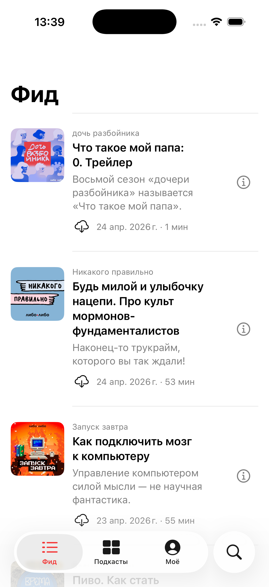

# 2026-04-25 — Шаг 1.8: тексты целиком, download в фиде, чистый плеер, очистка истории (сессия 11)

**Контекст:** Илья прислал четыре правки на 1.7:
1. Бесполезная иконка play в строке Фида — заменить на download-кнопку (тапа по строке хватает для воспроизведения).
2. **Тексты НЕ должны обрезаться нигде в приложении.** Никаких многоточий «...». Показывать всегда целиком.
3. Прогресс-бар в плеере «разъехался во всю ширину».
4. Должна быть возможность очистить историю.

## Что сделано

### 1. Download-икона в Фиде вместо play

[`Features/Feed/EpisodeRow.swift`](../../LiboLibo/Features/Feed/EpisodeRow.swift): `play.circle.fill` в нижней мета-строке заменён на `DownloadButton(episode:, style: .icon)`. Иконка циклирует состояние: cloud-arrow-down → spinner → checkmark.fill.

[`Features/Episodes/DownloadButton.swift`](../../LiboLibo/Features/Episodes/DownloadButton.swift): для inline-варианта в строке списка убрана фиксированная `font(.title3)` и большая `frame(44×44)`. Теперь иконка наследует размер текста соседних меток, hit zone — `frame(minWidth: 28, minHeight: 28)`. В плеере остаётся 44pt.

### 2. Все `lineLimit` снесены

Прошёлся по всем view, удалил все `.lineLimit(N)`:

- `Features/Feed/EpisodeRow.swift`: title, podcast name, preview — все без лимитов.
- `Features/Player/MiniPlayerView.swift`: title и podcast name без `.lineLimit(1)`.
- `Features/Podcasts/PodcastsView.swift`: name без `lineLimit(2)`.
- `Features/Podcasts/PodcastDetailView.swift`: name без `lineLimit(3)`.
- `Features/Episodes/EpisodeDetailView.swift`: title без `lineLimit(4)`.
- `Features/Search/SearchView.swift`: name без `lineLimit(2)`.
- `Features/Profile/ProfileView.swift` (subscription rows): name без `lineLimit(2)`.
- `Features/Player/PlayerView.swift`: title без `lineLimit(3)`.

Теперь длинные заголовки выпусков (например, «Будь милой и улыбочку нацепи. Про культ мормонов-фундаменталистов») рендерятся целиком на 2–3 строки, и описание выпуска — целиком на 2–3 строки. Никаких «…».

### 3. Прогресс-бар плеера

В 1.7 я обернул контент `PlayerView` в `GeometryReader`, чтобы ограничить размер обложки. Это сломало layout — слайдер растягивался на ширину `GeometryReader` (full screen) и игнорировал `.padding(.horizontal, 24)` внутри VStack.

В 1.8 — `GeometryReader` убран. Обложка ограничена через `.padding(.horizontal, 40)` (даёт нормальный квадратный вид и не упирается в края). Прогресс-слайдер: `.padding(.horizontal, 32)` — ровные поля по обе стороны.

### 4. Очистка истории

[`Services/HistoryService.swift`](../../LiboLibo/Services/HistoryService.swift): новый метод `clearAll()` — удаляет `items[]` и ключ из UserDefaults.

[`Features/Profile/ProfileView.swift`](../../LiboLibo/Features/Profile/ProfileView.swift): в header секции «История» — текстовая кнопка «Очистить» (red `liboRed`, .footnote). Тап вызывает confirmation alert «Очистить историю? Список прослушанных выпусков будет удалён» с двумя действиями: `Очистить` (.destructive) и `Отмена`.

## DoD фазы 1.8 — закрыты

- [x] Build: `** BUILD SUCCEEDED **`.
- [x] Свежий `.app` установлен и запущен на симуляторе.
- [x] В Фиде нет иконки play; вместо неё — DownloadButton с тремя состояниями.
- [x] Тексты везде целиком, многоточия отсутствуют.
- [x] Прогресс-слайдер плеера не выезжает за поля.
- [x] В «Моё» → «История» работает кнопка «Очистить» с подтверждением.

## Скриншот фида

Видно:
- «Будь милой и улыбочку нацепи. Про культ мормонов-фундаменталистов» — заголовок целиком на 3 строки.
- «Управление компьютером силой мысли — не научная фантастика.» — описание целиком.
- Cloud-arrow-down иконка слева от метаданных вместо red play.circle.fill.
- Info-кнопка справа — на месте.
