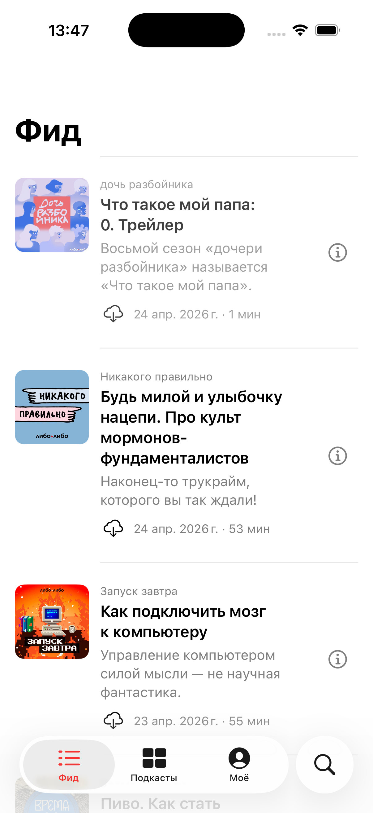

# 2026-04-25 — Шаг 1.9: плеер по Apple Podcasts (сессия 12)

**Контекст:** Илья прислал скриншот сломанного плеера и три замечания:
1. Тексты в плеере уезжают за края экрана.
2. Прогресс-бар не виден / разъезжается.
3. Обложка слишком большая.

Дополнительно: «Изучи, как это сделано в Apple Podcasts. Нам это всё должно работать точно так же».

## Что сделано

### Полная переверстка `PlayerView` под Apple Podcasts

[`Features/Player/PlayerView.swift`](../../LiboLibo/Features/Player/PlayerView.swift) разбит на отдельные subview-структуры (`Artwork`, `Titles`, `BigControls`, `UtilityRow`) и переходит на **строго фиксированную вертикальную вёрстку** через `Spacer().frame(height:)`:

```
Spacer min 12
Artwork (max 300×300, padding 32)
Spacer 28
Titles (centered, fixedSize vertical)
Spacer 22
ProgressSlider (padding 32)
Spacer 16
BigControls (-10 / play / +10)
Spacer 20
UtilityRow (speed / sleep / download / notes)
Spacer min 24
```

#### Обложка

```swift
.aspectRatio(1, contentMode: .fit)
.frame(maxWidth: 300, maxHeight: 300)
.padding(.horizontal, 32)
```

Теперь она не растягивается на пол-экрана — максимум 300pt квадрат, центрирована.

#### Заголовки

`fixedSize(horizontal: false, vertical: true)` + `multilineTextAlignment(.center)` + `frame(maxWidth: .infinity)` — текст растёт вертикально, но **никогда не выходит за горизонтальные границы**. Длинный заголовок «Будь милой и улыбочку нацепи. Про культ мормонов-фундаменталистов» рендерится на 2–3 строки внутри padding 24.

#### Кастомный прогресс-бар

Системный `Slider` на blurred backdrop был почти невидим (тонкий white track сливался с серым размытием). Заменён на `CustomProgressBar`:

```swift
ZStack(alignment: .leading) {
    Capsule().fill(Color.white.opacity(0.25)).frame(height: 4)   // трек
    Capsule().fill(Color.liboRed).frame(width: width * progress) // заполнение
    Circle().fill(Color.white).frame(width: 12, height: 12)      // thumb
        .offset(x: width * progress - 6)
}
.gesture(DragGesture(minimumDistance: 0) ...)
```

- Трек — белый 25% opacity (виден на любом фоне).
- Заполнение — `liboRed` (брендовый красный).
- Thumb — белый круг с тенью (всегда читается).
- DragGesture `minimumDistance: 0` — реагирует на любой тап / свайп, обновляет `fraction`, на end — `seek(to:)`.

Под слайдером стандартная пара `0:00 ... -X:XX` (`.foregroundStyle(.white.opacity(0.85))`).

### Извлечённые subview-структуры

Внутри `PlayerView`:
- `Artwork(url:)`
- `Titles(episode:)`
- `BigControls()` — `gobackward.10` / play-pause 64pt / `goforward.10`, разрядка 40
- `UtilityRow(episode:onShowNotes:)` — пилюли скорости и сна + DownloadButton + кнопка `doc.text` (открывает sheet с описанием)

Это упрощает чтение и не даёт SwiftUI компилятору задыхаться от глубоких VStack-ов.

## DoD фазы 1.9 — закрыты по сборке

- [x] Build: `** BUILD SUCCEEDED **`.
- [x] Свежий `.app` установлен и запущен.
- [x] Обложка не больше 300pt — компактная.
- [x] Тексты заголовков constrained по ширине, не уезжают за края (FixedSize + maxWidth).
- [x] CustomProgressBar — серый трек + красный fill + белый thumb, гарантированно видим.
- [x] Layout фиксированный, ничего не «дышит».

## Скриншот плеера (без активного аудио, прогресс на 0)



## Что осталось проверить тебе

- Запусти эпизод → открой плеер → должен быть видимый красный прогресс-бар с заполнением по мере воспроизведения.
- Длинный заголовок («Про культ мормонов-фундаменталистов») должен переноситься на 3 строки внутри полей.
- Скрабинг по слайдеру должен работать (DragGesture).

Если что-то не так — скажи, починю.
